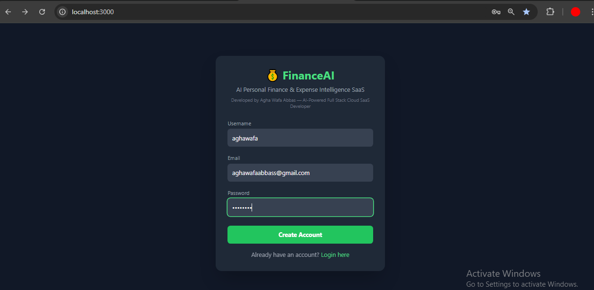
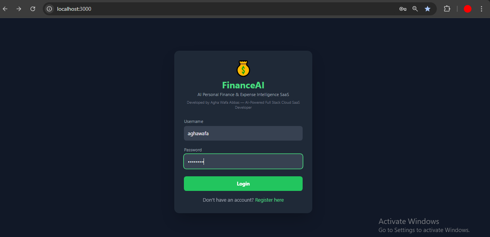
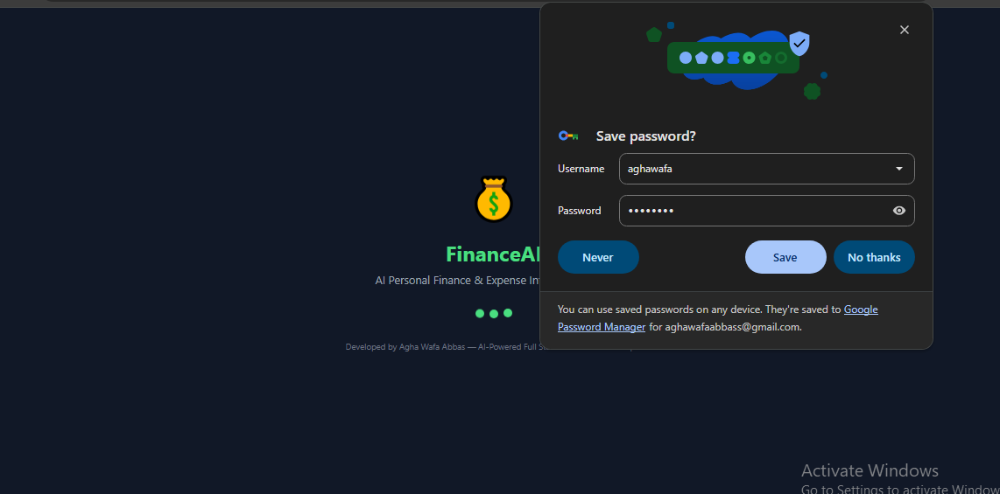

# 💰 FinanceAI — AI-Powered Personal Finance & Expense Intelligence SaaS


---

## 📌 Overview

**FinanceAI** is an AI-Powered Personal Finance & Expense Intelligence SaaS application built with Django, React, and Groq AI (Llama 3). It helps users track expenses, analyze spending patterns, set budgets, achieve saving goals, and get smart AI-powered financial advice — all in one platform.

> **Developed by:** Agha Wafa Abbas — AI-Powered Full Stack Cloud SaaS Developer

---

## 👤 Author

**Agha Wafa Abbas**
*AI-Powered Full Stack Cloud SaaS Developer*

📧 [agha.wafa@port.ac.uk](mailto:agha.wafa@port.ac.uk) | [awabbas@arden.ac.uk](mailto:awabbas@arden.ac.uk) | [wafa.abbas.lhr@rootsivy.edu.pk](mailto:wafa.abbas.lhr@rootsivy.edu.pk)

🎓 University of Portsmouth, UK · Arden University, UK · Pearson, UK · IVY College of Management Sciences, Lahore, Pakistan

---

## 🎯 Purpose & Problem Statement

### ❌ Problem:
People struggle with:
- Not knowing where their money goes
- Overspending without realizing it
- No clear saving plan
- Financial stress and poor money management

### ✅ Solution:
FinanceAI provides:
- Smart expense tracking with AI analysis
- Budget planning with smart alerts
- Saving goals with progress tracking
- Personalized AI chat assistant for financial advice

---

## 👥 Target Users (Actors)

| Actor | Description |
|-------|-------------|
| 👨‍🎓 Students | Track pocket money, rent, food expenses |
| 💼 Freelancers | Manage irregular income and expenses |
| 👨‍💼 Employees | Monthly salary planning and budgeting |
| 🌍 Immigrants | Manage expenses in new countries (Canada focus) |
| 🏢 Small Business Owners | Track daily expenses and profit/loss |

---

## 🚀 Key Features

| Feature | Description |
|---------|-------------|
| 🔐 JWT Authentication | Secure login/register system |
| 💰 Balance Tracker | Income vs expenses with progress bar & smart alerts |
| 🤖 AI Financial Analysis | Groq AI (Llama 3) analyzes spending patterns |
| 💬 AI Chat Assistant | Interactive AI financial advisor |
| 📊 Expense Charts | Pie chart & bar chart visualization |
| 📈 Monthly Comparison | Monthly spending trends & line chart |
| 📅 Budget Planner | Set and track monthly budgets |
| 🎯 Saving Goals | Set goals with progress tracking |
| 🏷️ Categories | Organize expenses by category |
| 🔍 Search & Filter | Filter by date, period, category |
| 📄 Export PDF | Download expense reports as PDF |
| 📧 Email Report | Send expense report to email |
| 👤 Profile Management | Avatar upload & profile editing |
| 🌙 Dark/Light Mode | Toggle between themes |
| 🌍 Multi-currency | PKR, CAD, USD, GBP, EUR, AED, SAR, AUD |
| 📱 PWA Ready | Installable as mobile app |

---

## 🛠️ Technology Stack

### Frontend:
| Technology | Purpose |
|-----------|---------|
| React 18 | UI Framework |
| Tailwind CSS 3 | Styling |
| Recharts | Data Visualization |
| Axios | API Communication |
| jsPDF | PDF Generation |
| Context API | State Management |

### Backend:
| Technology | Purpose |
|-----------|---------|
| Django 6.0.5 | Web Framework |
| Django REST Framework | API Development |
| SimpleJWT | JWT Authentication |
| PostgreSQL 17 | Database |
| Groq AI (Llama 3.3) | AI Analysis & Chat |
| Python Dotenv | Environment Variables |
| Pillow | Image Processing |
| Django CORS Headers | Cross-Origin Requests |

---

## 🏗️ System Design & Architecture

```
┌─────────────────────────────────────────────────┐
│                   CLIENT LAYER                   │
│         React + Tailwind CSS (Frontend)          │
│                                                  │
│  Login | Dashboard | Profile | Charts | Chat    │
└──────────────────────┬──────────────────────────┘
                       │ HTTP/REST API
                       │ JWT Token Auth
┌──────────────────────▼──────────────────────────┐
│                   API LAYER                      │
│         Django REST Framework (Backend)          │
│                                                  │
│  ┌─────────┐  ┌──────────┐  ┌───────────────┐  │
│  │  Users  │  │ Expenses │  │  AI Services  │  │
│  │   API   │  │   API    │  │  Groq/Llama3  │  │
│  └─────────┘  └──────────┘  └───────────────┘  │
│                                                  │
│         Gmail SMTP (Email Reports)              │
└──────────────────────┬──────────────────────────┘
                       │
┌──────────────────────▼──────────────────────────┐
│                 DATABASE LAYER                   │
│              PostgreSQL Database                 │
│                                                  │
│  Users | UserProfile | Expenses | Categories   │
│              Budgets | Media Files              │
└─────────────────────────────────────────────────┘
```

---

## 📁 Project Structure

```
finance-saas/
├── backend/
│   ├── core/
│   │   ├── settings.py
│   │   ├── urls.py
│   │   └── wsgi.py
│   ├── users/
│   │   ├── models.py
│   │   ├── views.py
│   │   ├── urls.py
│   │   └── ai_service.py
│   ├── expenses/
│   │   ├── models.py
│   │   ├── views.py
│   │   ├── serializers.py
│   │   └── urls.py
│   ├── .gitignore
│   └── manage.py
├── frontend/
│   ├── src/
│   │   ├── components/
│   │   │   ├── AIChat.js
│   │   │   ├── Categories.js
│   │   │   ├── ExpenseChart.js
│   │   │   ├── MonthlyChart.js
│   │   │   ├── SavingGoals.js
│   │   │   ├── SearchFilter.js
│   │   │   ├── Footer.js
│   │   │   └── Loader.js
│   │   ├── pages/
│   │   │   ├── Dashboard.js
│   │   │   ├── Login.js
│   │   │   ├── Register.js
│   │   │   ├── Profile.js
│   │   │   └── Budget.js
│   │   ├── context/
│   │   │   ├── AuthContext.js
│   │   │   └── ThemeContext.js
│   │   └── services/
│   │       └── api.js
│   ├── public/
│   │   ├── manifest.json
│   │   └── sw.js
│   └── package.json
├── Screenshots/
├── LICENSE
└── README.md
```

---

## ⚙️ Installation & Setup

### Prerequisites:
```
- Python 3.12+
- Node.js 18+
- PostgreSQL 17+
- Git
```

### 1. Clone Repository:
```bash
git clone https://github.com/Aghawafaabbass/finance-saas.git
cd finance-saas
```

### 2. Backend Setup:
```bash
cd backend
python -m venv venv
venv\Scripts\activate
pip install django djangorestframework djangorestframework-simplejwt
pip install psycopg2-binary python-dotenv groq Pillow django-cors-headers
```

### 3. Create `.env` file in backend folder:
```
GROQ_API_KEY=your_groq_api_key_here
EMAIL_HOST_USER=your_gmail@gmail.com
EMAIL_HOST_PASSWORD=your_16_digit_app_password
```

### 4. Database Setup:
```bash
python manage.py migrate
python manage.py createsuperuser
python manage.py runserver
```

### 5. Frontend Setup:
```bash
cd ../frontend
npm install
npm start
```

---

## 🔌 API Endpoints

### Authentication:
| Method | Endpoint | Description |
|--------|----------|-------------|
| POST | `/api/users/register/` | Register new user |
| POST | `/api/users/login/` | Login & get JWT token |
| POST | `/api/users/token/refresh/` | Refresh JWT token |

### User Management:
| Method | Endpoint | Description |
|--------|----------|-------------|
| GET | `/api/users/profile/` | Get user profile |
| PUT | `/api/users/update-profile/` | Update profile |
| POST | `/api/users/upload-avatar/` | Upload profile picture |
| GET/POST | `/api/users/income/` | Get/Set monthly income |

### Expenses:
| Method | Endpoint | Description |
|--------|----------|-------------|
| GET/POST | `/api/expenses/expenses/` | List/Create expenses |
| PUT/DELETE | `/api/expenses/expenses/{id}/` | Update/Delete expense |
| GET/POST | `/api/expenses/categories/` | List/Create categories |
| GET/POST | `/api/expenses/budgets/` | List/Create budgets |

### AI Services:
| Method | Endpoint | Description |
|--------|----------|-------------|
| GET | `/api/users/ai-analysis/` | AI expense analysis |
| POST | `/api/users/ai-chat/` | AI chat assistant |
| POST | `/api/users/send-report/` | Send email report |

---

## 📸 Screenshots

### 1. 📝 Register Page


### 2. 🔐 Login Page


### 3. ⏳ Loader Screen


### 4. 🌙 Dark Mode Dashboard


### 5. ☀️ Light Mode Dashboard


### 6. 💰 Income Set


### 7. 💰 Income Updated


### 8. 🧾 Rent Expense Adding


### 9. ✅ Rent Expense Saved


### 10. 🍔 Food Expense Adding


### 11. ✅ Food Expense Saved


### 12. 🚗 Transport Expense Adding


### 13. ✅ Transport Expense Saved


### 14. 🎬 Entertainment Expense Adding


### 15. ✅ Entertainment Expense Saved


### 16. 📊 Dashboard Balance Tracker


### 17. 🤖 AI Analysis


### 18. 📈 AI Analysis Results


### 19. 💬 AI Chat Assistant


### 20. 💬 AI Chat 2


### 21. 💬 AI Chat 3


### 22. 💬 AI Chat 4


### 23. 📊 Charts 1


### 24. 📊 Charts 2


### 25. 🍔 Food Category Adding


### 26. ✅ Food Category Saved


### 27. 🚗 Transport Category Adding


### 28. ✅ Transport Category Added


### 29. 🏠 Rent Category Adding


### 30. ✅ Rent Category Added


### 31. 🎬 Entertainment Category Adding


### 32. ✅ Entertainment Category Added


### 33. 📅 Budget Planner Adding


### 34. ✅ Budget Saved


### 35. 🎯 Saving Goals Adding


### 36. 🎯 Saving Goals Adding 2


### 37. ✅ Saving Goals Added


### 38. ✅ Saving Goals Added 2


### 39. ✅ Saving Goals Added 3


### 40. 📱 New Phone Goal


### 41. 🔍 Search Rent Filter


### 42. 🔍 Clearing Filter


### 43. 📄 Exporting PDF


### 44. 📄 PDF Report


### 45. 📧 Email Sending


### 46. 📧 Email Received


### 47. 👤 Profile Modal


### 48. 🖼️ Profile Picture Changed


### 49. ✏️ Editing Profile


### 50. ✅ Profile Updated


### 51. ✏️ Editing Expenses


### 52. ✅ Expenses Updated


### 53. 🗑️ Delete Expenses


### 54. 🔧 Django Administration


---

## 🔒 Security Features

- ✅ JWT Authentication with auto token refresh
- ✅ Password hashing (Django built-in)
- ✅ Environment variables for all secrets
- ✅ CORS protection
- ✅ User data isolation
- ✅ Secure file uploads with Pillow
- ✅ GitHub push protection

---

## ⚠️ Disclaimer

This project is developed for **educational and portfolio purposes** by **Agha Wafa Abbas** as part of academic and professional development:

The AI financial advice provided by this application is **for informational purposes only** and should **not** be considered as professional financial advice. Users should consult qualified financial advisors for important financial decisions.

The developer is **not responsible** for any financial decisions made based on the AI recommendations provided by this application.

---

## 📄 License

This project is licensed under the **MIT License** — see the [LICENSE](LICENSE) file for details.

---

## 🙏 Acknowledgements

- [Groq AI](https://groq.com) — Blazing fast Llama 3 API
- [Django](https://djangoproject.com) — Robust backend framework
- [React](https://reactjs.org) — Powerful frontend library
- [Tailwind CSS](https://tailwindcss.com) — Utility-first CSS framework
- [Recharts](https://recharts.org) — Beautiful data visualizations
- [PostgreSQL](https://postgresql.org) — Reliable database

---

<div align="center">

### 💰 FinanceAI

**Made with ❤️ by Agha Wafa Abbas**

*AI-Powered Full Stack Cloud SaaS Developer*

*University of Portsmouth, UK · Arden University, UK · Pearson, UK · IVY College of Management Sciences, Lahore, Pakistan*

</div>
